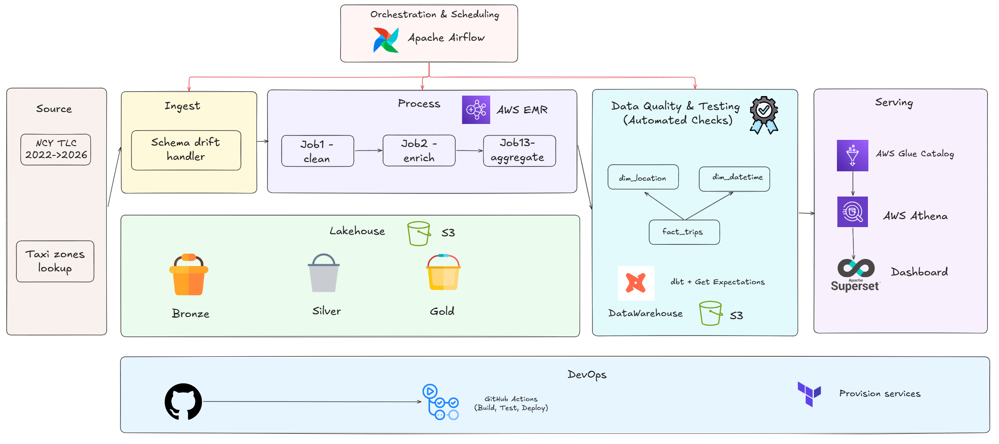
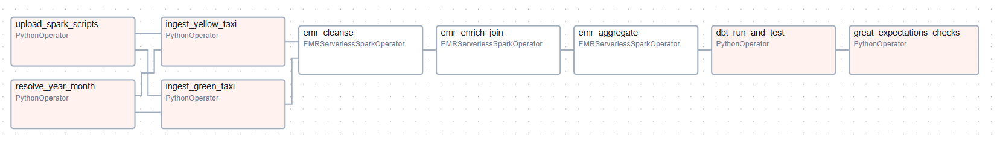
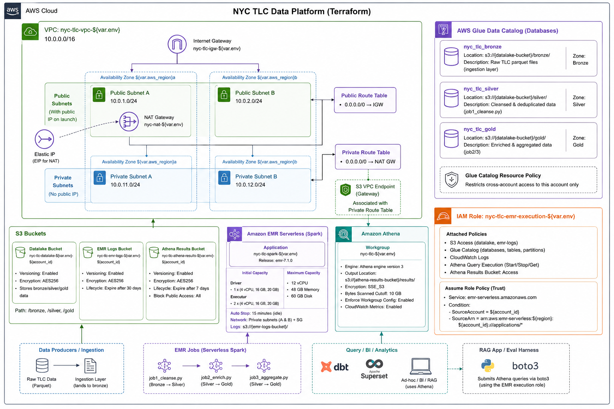
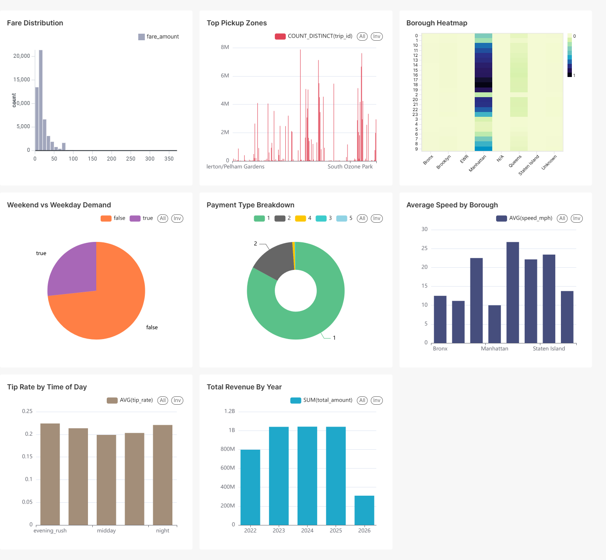

# 🚕 NYC TLC Data Platform

> A production-grade, end-to-end data platform built on the NYC Taxi & Limousine Commission dataset.
> Ingests 100M+ trip records per year, processes through a distributed lakehouse pipeline, and serves
> a BI dashboard.


---

## Table of Contents

- [Overview](#overview)
- [Architecture](#architecture)
- [Tech Stack](#tech-stack)
- [Dataset](#dataset)
- [Project Structure](#project-structure)
- [Quick Start (5 Steps)](#quick-start-5-steps)
- [AWS Infrastructure Setup](#aws-infrastructure-setup)
- [Pipeline Deep Dive](#pipeline-deep-dive)
- [Data Model](#data-model)
- [Data Quality](#data-quality)
- [Serving Layer](#serving-layer)
- [Observability](#observability)
- [Engineering Practices](#engineering-practices)
- [Cost Estimate](#cost-estimate)
- [Runbook](#runbook)
- [FAQ / Q&A](#faq--qa)
- [Contributing](#contributing)

---

## Overview

This project demonstrates a **compact, production-quality data platform** that ingests real NYC taxi trip data, processes it through a multi-zone lakehouse using AWS EMR Serverless + PySpark, models it with dbt, and serves it via  **Track A — Dashboard** (Apache Superset with time-series drill-down charts)


### What this platform answers

| Business Question | Chart / Endpoint |
|---|---|
| Which borough generates the most revenue by hour of day? | Superset time-series heatmap |
| How does demand change across weekday vs weekend? | Superset bar chart with DOW dimension |
| What is the 7-day rolling trend of trip volume per borough? | Superset line chart |
| What is the average fare for airport trips vs non-airport? | Superset comparison chart |
<!-- | Natural language: "Which borough has the highest average fare on weekday mornings?" | RAG API `/ask` | -->

---

## Architecture


All services run locally via **docker-compose**. AWS infrastructure (EMR Serverless, S3, Glue, Athena) is provisioned via **Terraform**.

---

## Tech Stack

| Layer | Technology | Reason |
|---|---|---|
| **Ingestion** | Python 3.11 + httpx | Async-friendly, fast downloads |
| **Orchestration** | Apache Airflow 2.9 | Industry standard, retry policy, sensors |
| **Storage** | AWS S3 + Delta Lake 3.1 | ACID, time travel, open format, no vendor lock-in |
| **Processing** | AWS EMR Serverless + PySpark 3.5 | Distributed, pay-per-job, no cluster management |
| **Catalog** | AWS Glue Data Catalog | Auto-register schema from Delta tables |
| **Query** | AWS Athena | Serverless SQL on S3, integrates with Superset/dbt |
| **Modeling** | dbt Core + dbt-athena | SQL-native transforms, built-in tests, lineage |
| **Data Quality** | Great Expectations 0.18 | 7 checks, quarantine behavior |
| **Dashboard** | Apache Superset 3.1 | Open-source, connects to Athena natively |
| **IaC** | Terraform 1.8 | Reproducible AWS infra |
| **Containerization** | Docker Compose | Full local stack in one command |
| **CI/CD** | GitHub Actions | Lint + test + build on every push |
| **Linting** | ruff + black | Fast, opinionated, zero-config |
| **Logging** | structlog | Structured JSON logs, not bare prints |
<!-- | **AI App** | LangChain + FastAPI | RAG on trip data, OpenAI GPT-4o-mini | -->
<!-- | **Experiment Tracking** | MLflow 2.13 | Track RAG eval runs, latency, quality scores | -->

---

## Dataset

**Source**: [NYC TLC Trip Record Data](https://www.nyc.gov/site/tlc/about/tlc-trip-record-data.page) hosted on AWS Open Data Registry (`registry.opendata.aws`).

| Property | Value |
|---|---|
| Vehicle types | Yellow Taxi, Green Taxi |
| Time range | January 2022 – April 2026 |
| Raw size | ~50 GB/year (~4 GB/month) |
| Record count | ~100M trips/year |
| Format | Parquet |
| Update cadence | Monthly (released ~10th of following month) |

### Entities (joinable tables)

| Table | Description | Key |
|---|---|---|
| `yellow_tripdata` | Yellow taxi trips (Manhattan-heavy) | pickup_datetime + PULocationID |
| `green_tripdata` | Green taxi trips (outer boroughs) | pickup_datetime + PULocationID |
| `taxi_zone_lookup` | 263 NYC taxi zones with Borough + service zone | LocationID |

### yellow_tripdata/ green_tripdata Schema

| # | Field | Type | Description |
|---|------|------|-------------|
| 1 | vendorid | bigint | Identifier of the taxi vendor. Example: 1 = Creative Mobile Technologies, 2 = VeriFone. |
| 2 | pickup_datetime | timestamp | Timestamp when the trip started (pickup time). |
| 3 | dropoff_datetime | timestamp | Timestamp when the trip ended (dropoff time). |
| 4 | passenger_count | bigint | Number of passengers in the trip. |
| 5 | trip_distance | double | Total distance of the trip in miles. |
| 6 | ratecodeid | bigint | Fare rate type applied to the trip (e.g., standard, airport, negotiated fare). |
| 7 | store_and_fwd_flag | string | Flag indicating if trip data was stored temporarily in vehicle before sending. Y = Yes, N = No. |
| 8 | pulocationid | bigint | Pickup taxi zone ID (foreign key to `taxi_zone_lookup.LocationID`). |
| 9 | dolocationid | bigint | Dropoff taxi zone ID (foreign key to `taxi_zone_lookup.LocationID`). |
| 10 | payment_type | bigint | Payment method used (cash, card, etc.). |
| 11 | fare_amount | double | Base fare before taxes, tips, tolls, and surcharges. |
| 12 | extra | double | Additional charges (e.g., night surcharge, rush hour surcharge). |
| 13 | mta_tax | double | Metropolitan Transportation Authority tax. |
| 14 | tip_amount | double | Tip amount paid by passenger (usually card payments). |
| 15 | tolls_amount | double | Total toll fees during the trip. |
| 16 | improvement_surcharge | double | Regulatory improvement surcharge added to taxi fares. |
| 17 | total_amount | double | Final total amount charged to passenger (all components included). |
| 18 | congestion_surcharge | double | NYC congestion surcharge applied to trips in congestion zones. |
| 19 | airport_fee | double | Additional fee applied for airport pickups/dropoffs. |
| 20 | cbd_congestion_fee | double | Central Business District congestion pricing fee (if applicable). |

### taxi_zone_lookup Schema

| Field | Type | Description |
|---------|---------|-------------|
| `LocationID` | Int64 | Unique identifier for a NYC Taxi & Limousine Commission (TLC) taxi zone. Used as the primary key and for joining with trip tables. |
| `Borough` | String | New York City borough where the taxi zone is located (Manhattan, Brooklyn, Queens, Bronx, Staten Island, EWR, Unknown). |
| `Zone` | String | Human-readable name of the taxi zone (e.g., Midtown Center, Upper East Side South, JFK Airport). |
| `service_zone` | String | TLC service classification of the zone, such as Yellow Zone, Boro Zone, Airports, or EWR. |


### Time dimension

All trips have `pickup_datetime` and `dropoff_datetime` timestamps. The pipeline partitions by
`pickup_date` (daily) on silver/gold zones, enabling efficient time-range queries and partition pruning.

---

## Project Structure

```
nyc-tlc-platform/
│
├── .github/
│   └── workflows/
│       └── ci.yml                  # GitHub Actions: lint + test + docker build
│
├── infra/
│   ├── docker-compose.yml          # Full local stack: Airflow, Superset, MLflow, RAG API
│   └── terraform/
│       ├── main.tf                 # Provider, S3 buckets, VPC endpoints
│       ├── emr_serverless.tf       # EMR Serverless application + IAM roles
│       ├── glue.tf                 # Glue Data Catalog databases
│       ├── athena.tf               # Athena workgroup + result bucket
│       ├── networking.tf           # Configure network
│       ├── variables.tf
│       └── outputs.tf              # application_id, role_arn, bucket_name
│
├── ingestion/
│   ├── dags/
│   │   └── nyc_tlc_pipeline.py     # Airflow DAG (end-to-end, idempotent)
│   ├── operators/
│   │   └── emr_serverless_operator.py  # Custom Airflow operator (submit + poll)
│   └── src/
│   │   ├── downloader.py           # Download TLC parquet files
│   │   ├── schema_validator.py     # Validate schema, quarantine bad files
│   │   └── uploader.py             # Upload to S3 bronze zone
│   └── bootstrap/
│
├── spark_jobs/
│   ├── job1_cleanse.py             # Bronze → Silver: cleanse + dedup + derive
│   ├── job2_enrich_join.py         # Silver → Gold: join zones + payment dim
│   └── job3_aggregations.py        # Gold → Gold/KPIs: window functions + rolling avg
│
├── dbt_project/
│   ├── dbt_project.yml
│   ├── profiles.yml.example        # Athena connection template
│   ├── models/
│   │   ├── staging/                # Raw source references
│   │   ├── intermediate/           # Join logic
│   │   └── marts/
│   │       ├── fact_trips.sql      # Incremental fact table
│   │       ├── dim_location.sql    # 263 taxi zones dimension
│   │       ├── dim_datetime.sql    # Date/time dimension
│   │       ├── mart_hourly_kpi.sql # Pre-aggregated OBT for dashboard
│   │       └── schema.yml          # dbt tests + documentation
│   └── macros/
│       └── replace_where.sql       # Idempotent incremental macro
│
├── data_quality/
│   ├── run_expectations.py         # 7 GE checks, quarantine on critical fail
│   └── expectations/
│       └── nyc_tlc_gold_suite.json # Expectation suite definition
│
├── serving/
│   ├── superset/
│       ├── dashboard_export.json   # Import-ready Superset dashboard
│       └── build_charts.py        # Individual chart configs
│
├── tests/
│   ├── unit/
│   │   └── test_transformations.py # 6 unit tests for Spark logic
│   └── integration/
│       └── test_pipeline_e2e.py    # End-to-end pipeline on sample data
│
├── docs/
│   ├── assets/
│   └── nyc_tlc_schema_reference.pdf # Schema Docs
│
├── .env.example                    # Environment variable template (no real secrets)
├── pyproject.toml                  # Dependencies + ruff + black config
├── Makefile                        # Common commands (lint, test, up, deploy)
└── README.md                       # This file
```

---

## Quick Start (5 Steps)

### Prerequisites

| Tool | Version | Install |V
|---|---|---|
| Docker + Docker Compose | Docker 24+ | [docs.docker.com](https://docs.docker.com/get-docker/) |
| Python | 3.11 | [python.org](https://www.python.org/downloads/) |
| Terraform | 1.8+ | [terraform.io](https://developer.hashicorp.com/terraform/install) |
| AWS CLI | 2.x | [aws.amazon.com/cli](https://aws.amazon.com/cli/) |
| AWS account | — | Region: `ap-southeast-1` (Singapore) |

---

### Step 1 — Clone and configure environment

```bash
git clone https://github.com/yourname/nyc-tlc-platform.git
cd nyc-tlc-platform

# Copy environment template
cp .env.example .env
```

Open `.env` and fill in your values:

```dotenv
AWS_ACCESS_KEY_ID=AKIA...
AWS_SECRET_ACCESS_KEY=...
AWS_DEFAULT_REGION=ap-southeast-1

# Fill these after Step 2 (Terraform outputs)
EMR_APPLICATION_ID=
EMR_EXECUTION_ROLE_ARN=
TLC_S3_BUCKET=

# Generate with: python -c "from cryptography.fernet import Fernet; print(Fernet.generate_key().decode())"
AIRFLOW_FERNET_KEY=

SUPERSET_SECRET_KEY=change-me-in-production
```

If you already provisioned Terraform, generate the repo-managed environment file as well:

```bash
terraform output -json > infra/terraform/generated/outputs.json
python infra/terraform/scripts/generate_env.py
```

---

### Step 2 — Provision AWS infrastructure with Terraform
```bash
aws config
aws sts get-caller-identity # Check identity
cd infra/terraform

# Initialize providers
terraform init

# Preview what will be created
terraform plan -out=tfplan
terraform fmt # (Optional) Format code
terraform validate # (Optional) Check logic code
terraform apply 
# Apply (creates S3 buckets, EMR Serverless app, IAM roles, Glue catalog, Athena)
terraform output -json > 'generated/outputs.json'
python infra/terraform/scripts/generate_env.py # Add subnets, arn,... to env.generated
```
---

### Step 3 — Upload Spark scripts to S3

```bash
cd ../../  # back to project root

# Upload all PySpark jobs so EMR Serverless can access them
make upload-spark-jobs

# Equivalent to:
# aws s3 sync spark_jobs/ s3://$TLC_S3_BUCKET/spark-scripts/
```

---

### Step 4 — Start the local stack

```bash
make up

# Or directly:
docker-compose -f infra/docker-compose.yml up -d
```

Wait ~60 seconds for all services to be healthy, then open:

| Service | URL | Default credentials |
|---|---|---|
| Airflow | http://localhost:8080 | `admin` / `admin` |
| Superset | http://localhost:8088 | `admin` / `admin` |


---

### Step 5 — Trigger the pipeline

**Option A — Airflow UI:**

1. Open http://localhost:8080
2. Find the DAG `nyc_tlc_monthly_pipeline`
3. Toggle it **ON**
4. Click **Trigger DAG** → set `execution_date` to `YYYY-MM` (2026-04)
5. Watch the task graph: `resolve_year_month + upload_scripts → ingest_yellow + ingest_green → emr_cleanse → emr_enrich → emr_aggregate → dbt_run → dq_checks`

**Option B — CLI (backfill all of 2023):**

```bash
docker exec -it airflow-scheduler \
  airflow dags backfill nyc_tlc_monthly_pipeline \
    --start-date 2022-01-01 \
    --end-date   2026-04-01 \
    --reset-dagruns
```

---

## AWS Infrastructure Setup

### Resources created by Terraform

| Resource | Name | Purpose |
|---|---|---|
| S3 Bucket | `nyc-tlc-datalake-{env}-{account_id}` | Bronze / Silver / Gold zones |
| EMR Serverless App | `nyc-tlc-spark-{env}` | PySpark job runtime |
| IAM Role | `nyc-tlc-emr-execution-{env}` | EMR → S3 + Glue permissions |
| Glue Database | `nyc_tlc_gold` | Auto-registered Delta table catalog |
| Athena Workgroup | `nyc-tlc-{env}` | SQL query engine for dbt + Superset |
| S3 (Athena results) | `nyc-tlc-athena-results-{env}` | Athena query output storage |
| VPC Endpoint | `s3` type | EMR workers access S3 without NAT Gateway |



### S3 bucket structure

```
s3://nyc-tlc-datalake-dev-{account}/
├── bronze/
│   ├── yellow/year=2023/month=01/yellow_tripdata_2023-01.parquet
│   ├── yellow/year=2023/month=02/...
│   └── green/year=2023/month=01/...
├── silver/
│   ├── yellow/pickup_date=2023-01-01/part-00000-xxx.parquet
│   └── green/pickup_date=2023-01-01/...
├── gold/
│   ├── fact_trips/pickup_date=2023-01-01/...
│   └── hourly_kpis/pickup_date=2023-01-01/...
├── quarantine/                      # Schema-violating files
│   └── yellow/2023-01/...
├── spark-scripts/                   # PySpark job entry points
│   ├── job1_cleanse.py
│   ├── job2_enrich_join.py
│   └── job3_aggregations.py
└── emr-logs/                        # Driver + executor logs per job run
    └── emr_cleanse/2023-01-01/...
```

### EMR Serverless configuration

```
Application: nyc-tlc-spark-dev
Release:     emr-7.1.0 (Spark 3.5.1)

Pre-initialized capacity (reduces cold-start to ~15 seconds):
  Driver:   1 worker × 4 vCPU × 16 GB
  Executor: 2 workers × 4 vCPU × 16 GB

Maximum capacity:
  64 vCPU · 256 GB · 1 TB disk

Auto-stop: idle for 15 minutes → release pre-initialized capacity
```

---

## Pipeline Deep Dive

### Airflow DAG — `nyc_tlc_monthly_pipeline`

```
upload_spark_scripts      resolve_year_month
       └────────────┬──────────────┘
                    │
               ┌────┴────┐
               ▼         ▼
            ingest_   ingest_          (parallel — yellow and green)
            yellow    green
               └────┬────┘
                    ▼
               emr_cleanse             (Job 1: Bronze → Silver)
                    │
                    ▼
               emr_enrich_join         (Job 2: Silver → Gold)
                    │
                    ▼
               emr_aggregate           (Job 3: Gold → Gold/KPIs)
                    │
                    ▼
               dbt_run_and_test        (dbt run + dbt test)
                    │
                    ▼
               great_expectations      (7 DQ checks)
```

**Idempotency guarantees:**

| Layer | Mechanism |
|---|---|
| Download | Skip if local file exists |
| S3 upload | `head_object` check before upload |
| Delta Lake write | `replaceWhere` — overwrite only the target month partition |
| dbt | `unique_key` incremental strategy |
| Airflow | `execution_date` as natural idempotency key; `catchup=True` for backfill |

**Retry policy:**

```python
retries=2
retry_delay=5 minutes
retry_exponential_backoff=True
max_retry_delay=20 minutes
execution_timeout=3 hours
```

---

### Job 1 — Cleanse (Bronze → Silver)

Reads raw Parquet from bronze, applies business rules, writes Delta Lake to silver.

**Transformations:**
1. Normalize column names between yellow (`tpep_*`) and green (`lpep_*`) taxi schemas
2. Filter outliers: `trip_distance > 0 AND < 200`, `total_amount > 0 AND < 5000`, `passenger_count 1–6`
3. Filter unrealistic durations: `1 min < duration < 300 min`, `speed < 120 mph`
4. Derive: `trip_duration_min`, `speed_mph`, `pickup_date`, `pickup_hour`, `pickup_dow`, `vehicle_type`
5. Generate `trip_id`: `SHA-256(VendorID|pickup_datetime|PULocationID|DOLocationID)`
6. Deduplicate on `trip_id`
7. Enforce stable schema/types to maintain consistency across TLC dataset versions.
8. Handle schema evolution (2025 TLC changes):Rename Airport_fee → airport_fe, Add cbd_congestion_fee column,Use mergeSchema=true for automatic Delta schema evolution.
9. Output format: Delta Lake (Silver layer) with automatic Symlink Manifest generation for Athena compatibility.
10.  Output partition key: pickup_year, pickup_month (monthly partitioning, as implemented in the code).
**Justification:** Monthly partitions provide a balance between query pruning efficiency and S3/Athena metadata overhead.
---

### Job 2 — Enrich + Join (Silver → Gold)
1. Load and combine Silver datasets using unionByName() for yellow and green taxi trips.
2. Filter target partition by pickup_year and pickup_month.
3. Broadcasts the 263-row taxi zone lookup (no shuffle) and joins payment type dimension.
**Joins:**
- `fact_trips ⋈ taxi_zone_lookup` on `PULocationID` → `pickup_borough`, `pickup_zone`, `pickup_service_zone`
- `fact_trips ⋈ taxi_zone_lookup` on `DOLocationID` → `dropoff_borough`, `dropoff_zone`
- `fact_trips ⋈ payment_dim` on `payment_type` → `payment_type_name`
4. Derive enrichment features:
**Derived:**
- `tip_rate = tip_amount / fare_amount`
- `is_airport_trip = pickup_service_zone IN ('Airports', 'EWR')`
- `is_weekend = pickup_dow IN (1, 7)`
- `time_of_day`: morning_rush / midday / evening_rush / night / late_night
5. Optimize write performance: Use broadcast joins for small dimensions,repartition(8, pickup_year, pickup_month) before writing.
6. Handle schema evolution (2025 TLC changes): Support airport_fee and cbd_congestion_fee, Use mergeSchema=true for automatic Delta schema updates.
7. Output format: Delta Lake (Gold layer) with automatic Symlink Manifest generation for Athena compatibility.
8. Glue/Athena registration
9. Output partition key: pickup_year, pickup_month (monthly partitioning).
---

### Job 3 — Aggregations (Gold → Gold/KPIs)

Three non-trivial transformations for the dashboard serving layer:

**Transformation 1 — Hourly borough KPIs:**
```sql
GROUP BY pickup_date, pickup_hour, pickup_borough
→ trip_count, total_revenue, avg_fare, avg_distance_mi,
   avg_duration_min, avg_tip_rate, airport_trips, unique_pickup_zones
```

**Transformation 2 — 7-day rolling average (window function):**
```python
Window.partitionBy("pickup_borough")
      .orderBy(col("pickup_datetime_hour").cast("long"))
      .rangeBetween(-(7 * 24 * 3600), 0)
→ rolling_7d_trips, rolling_7d_revenue
```

**Transformation 3 — Revenue efficiency metric:**
```python
revenue_per_mile = avg_fare / avg_distance_mi
```

---

## Data Model

### Star Schema

```
                    ┌─────────────────┐
                    │   dim_datetime  │
                    │  PK: date_id    │
                    │  pickup_date    │
                    │  day_of_week    │
                    │  week_of_year   │
                    │  is_holiday     │
                    └────────┬────────┘
                             │
┌──────────────┐    ┌────────┴────────┐    ┌──────────────────┐
│ dim_location │    │   fact_trips    │    │  mart_hourly_kpi │
│ PK: loc_id   │◄───│ PK: trip_id     │    │  (OBT — pre-agg) │
│ borough      │    │ FK: loc_id (PU) │    │  grain: borough  │
│ zone         │    │ FK: loc_id (DO) │    │         × hour   │
│ service_zone │    │ FK: date_id     │    │  trip_count      │
└──────────────┘    │ fare_amount     │    │  total_revenue   │
                    │ tip_amount      │    │  rolling_7d_avg  │
                    │ trip_distance   │    └──────────────────┘
                    │ trip_duration   │
                    │ is_airport_trip │
                    │ vehicle_type    │
                    └─────────────────┘
```

### Table documentation

#### `fact_trips`
**Grain:** One row per taxi trip.
**Primary key:** `trip_id` (SHA-256 hash — deterministic, idempotent)
**Partition key:** `pickup_date`

| Column | Type | Description |
|---|---|---|
| `trip_id` | STRING | SHA-256(VendorID\|pickup_dt\|PULocationID\|DOLocationID) |
| `pickup_at` | TIMESTAMP | Trip start datetime |
| `dropoff_at` | TIMESTAMP | Trip end datetime |
| `pickup_date` | DATE | Partition key |
| `pickup_hour` | INT | Hour of day (0–23) |
| `pickup_dow` | INT | Day of week (1=Sun, 7=Sat) |
| `pickup_location_id` | INT | FK → dim_location |
| `dropoff_location_id` | INT | FK → dim_location |
| `pickup_borough` | STRING | Manhattan / Brooklyn / Queens / Bronx / Staten Island |
| `dropoff_borough` | STRING | Borough at drop-off |
| `pickup_zone` | STRING | Specific taxi zone name |
| `payment_type` | INT | Raw payment code |
| `payment_type_name` | STRING | Credit card / Cash / No charge / Dispute |
| `passenger_count` | INT | Number of passengers (1–6) |
| `trip_distance` | DOUBLE | Miles traveled |
| `trip_duration_min` | DOUBLE | Duration in minutes |
| `fare_amount` | DOUBLE | Base fare (USD) |
| `tip_amount` | DOUBLE | Tip amount (USD) |
| `tip_rate` | DOUBLE | tip_amount / fare_amount |
| `total_amount` | DOUBLE | Total charged (USD) |
| `is_airport_trip` | BOOLEAN | Pickup at JFK / LaGuardia / EWR |
| `is_weekend` | BOOLEAN | Saturday or Sunday |
| `time_of_day` | STRING | morning_rush / midday / evening_rush / night / late_night |
| `vehicle_type` | STRING | yellow / green |

#### `dim_location`
**Grain:** One row per taxi zone (263 zones).
**Primary key:** `location_id`

| Column | Type | Description |
|---|---|---|
| `location_id` | INT | TLC zone ID (1–263) |
| `borough` | STRING | NYC borough |
| `zone` | STRING | Zone name (e.g. "JFK Airport") |
| `service_zone` | STRING | Boro Zone / Yellow Zone / Airports / EWR |

#### `mart_hourly_kpi`
**Grain:** One row per (pickup_borough × pickup_hour × pickup_date).
**Purpose:** Pre-aggregated OBT — Superset queries this directly (no live aggregation needed).

| Column | Type | Description |
|---|---|---|
| `pickup_datetime_hour` | TIMESTAMP | Truncated to hour |
| `pickup_date` | DATE | Partition key |
| `pickup_hour` | INT | 0–23 |
| `pickup_borough` | STRING | NYC borough |
| `trip_count` | LONG | Total trips this hour |
| `total_revenue` | DOUBLE | Sum of total_amount |
| `avg_fare` | DOUBLE | Average fare_amount |
| `avg_distance_mi` | DOUBLE | Average trip distance |
| `avg_duration_min` | DOUBLE | Average trip duration |
| `avg_tip_rate` | DOUBLE | Average tip/fare ratio |
| `airport_trips` | LONG | Count of airport pickups |
| `rolling_7d_trips` | DOUBLE | 7-day rolling avg of trip_count per borough |
| `rolling_7d_revenue` | DOUBLE | 7-day rolling avg of revenue per borough |
| `revenue_per_mile` | DOUBLE | avg_fare / avg_distance_mi |

---

## Data Quality

Great Expectations runs 7 checks after every pipeline run. Critical failures **block downstream**
tasks and quarantine the partition. Non-critical failures log warnings only.

| # | Check | Criticality | Behavior on fail |
|---|---|---|---|
| 1 | `trip_id` is not null | Critical | Block + quarantine |
| 2 | `trip_id` is unique | Critical | Block + quarantine |
| 3 | `total_amount` between 0 and 5,000 | Critical | Block + quarantine |
| 4 | `PULocationID` between 1 and 263 | Critical | Block + quarantine |
| 5 | Table row count ≥ 500,000 per month | Critical | Block + quarantine |
| 6 | `pickup_date` within expected month range | Non-critical | Log warning |
| 7 | `fare_amount` mean between $5 and $100 | Non-critical | Log warning |

```bash
# Run DQ checks manually
make dq-check YEAR_MONTH=2023-06
```

---

## Serving Layer

### Track A — Superset Dashboard

Connect Superset to Athena:

1. Open http://localhost:8088 → **Settings → Database Connections → + Database**
2. Select **Amazon Athena**
3. Connection string: `awsathena+rest://ap-southeast-1/nyc_tlc_gold?s3_staging_dir=s3://nyc-tlc-athena-results-dev/superset/`
4. Import dashboard: **Dashboards → Import → upload** `serving/superset/dashboard_export.json`

**Three charts included:**

| Chart | Type | Business question |
|---|---|---|
| Trip volume by borough over time | Time-series line (drill-down by vehicle_type) | When and where is demand highest? |
| Average fare heatmap by hour × day | Heatmap (hour of day vs day of week) | When are fares most expensive? |
| Payment Type Breakdown | Pie Chart | What is the popular payment method? |

> All Superset queries run on **Athena** — not local cache. Partition pruning by `pickup_date`
> keeps query cost under $0.01 per chart render.



---

<!-- ### Track B — RAG API

#### Endpoints

```
POST /ask          Ask a natural language question about NYC taxi data
GET  /health       Health check
GET  /metrics      Prometheus-format metrics (latency, request count)
```

#### Example usage

```bash
# Ask a business question
curl -X POST http://localhost:8000/ask \
  -H "Content-Type: application/json" \
  -d '{"question": "Which borough has the highest average fare on weekday mornings?"}'

# Response
{
  "answer": "Manhattan has the highest average fare at $18.42 during weekday morning rush hours (7–10am), followed by Queens at $15.20. This is largely driven by airport trips from JFK and LaGuardia which inflate the borough average.",
  "latency_ms": 1842.3,
  "run_id": "abc123def456"
}
```

#### Evaluation harness

5 test cases are tracked in MLflow, measuring keyword coverage:

```bash
make eval
# Opens MLflow at http://localhost:5000 → Experiment: nyc-tlc-rag-eval
```

| Case | Question | Measured metric |
|---|---|---|
| 1 | Borough fare ranking | keyword_score: Manhattan, fare, $ |
| 2 | Peak demand hours | keyword_score: hour, trips, rush |
| 3 | Airport trip volume | keyword_score: airport, JFK, LaGuardia |
| 4 | Credit card tip rate | keyword_score: tip, credit, % |
| 5 | Busiest day of week | keyword_score: Friday, Saturday, trips |

```bash
# View all MLflow experiments
open http://localhost:5000
```

--- -->

<!-- ## Observability

Three metrics are logged as structured JSON on every pipeline run:

### 1. Job duration
```json
{"event": "emr_job_finished", "job_run_id": "xxx", "duration_sec": 847, "state": "SUCCESS"}
```

### 2. Records processed
```json
{"event": "clean_count", "count": 7432190, "dropped": 84231, "drop_pct": 1.1, "vehicle": "yellow"}
```

### 3. Data freshness
```json
{"event": "ingest_complete", "year_month": "2023-06", "s3_key": "bronze/yellow/year=2023/month=06/..."}
```

### Viewing logs

```bash
# Airflow task logs
docker logs airflow-scheduler --tail 100 -f

# EMR Serverless driver logs (after a job runs)
aws s3 cp s3://$TLC_S3_BUCKET/emr-logs/emr_cleanse/2023-01-01/driver/stdout ./emr_stdout.log

# MLflow UI — RAG latency and eval scores
open http://localhost:5000
```

--- -->

## Engineering Practices

### Running tests

```bash
# All unit tests (6 tests)
make test

# Integration test (mini end-to-end pipeline on sample data)
make integration-test

# Both
make test integration-test
```

### Lint and format

```bash
# Check
make lint

# Auto-fix
make format
```

### Available make targets

```bash
make setup            # Install dependencies + pre-commit hooks
make lint             # ruff check + black check
make format           # ruff fix + black format
make test             # Unit tests with coverage report
make integration-test # E2E pipeline test on sample data
make up               # docker-compose up -d (full stack)
make down             # docker-compose down
make upload-spark-jobs # aws s3 sync spark_jobs/ s3://$TLC_S3_BUCKET/spark-scripts/
make tf-plan          # terraform plan
make tf-apply         # terraform apply
make dbt-run          # dbt run (marts only)
make dbt-test         # dbt test
make dq-check         # Run Great Expectations suite
make eval             # Run RAG evaluation harness
```

### CI Pipeline (GitHub Actions)

Every push and pull request triggers the GitHub Actions checks below. Each workflow uploads artifacts so you can inspect failures after the run.

```
lint-and-test
  ├── ruff check
  ├── black --check
  ├── pytest tests/unit/ --cov
  └── docker build

integration-test (after lint-and-test passes)
  ├── docker-compose up
  └── pytest tests/integration/

security-scan
  ├── pip-audit
  └── bandit
```

Pull requests require both jobs green before merge.

Artifacts are uploaded as `ci-monitoring-*`, `integration-monitoring-*`, and `security-monitoring-*`.

### GitHub Guardrails

Set the following in GitHub repository settings for `main`:

1. Require a pull request before merging.
2. Require status checks to pass before merging.
3. Require the checks `CI / lint-and-test`, `CI / integration-test`, and `Security Validation / security-scan`.
4. Require review from CODEOWNERS for changes under `infra/`, `infra/terraform/`, `.github/workflows/`, and `pipelines/`.

Repo-level Copilot instructions live in `.github/copilot-instructions.md`, and the security review agent is defined in `.github/agents/security-reviewer.agent.md`.

---

## Cost Estimate

Running the full 2023 backfill (12 months of data):

| Service | Usage | Estimated cost |
|---|---|---|
| EMR Serverless | 3 jobs × 12 months × ~2h × 16 vCPU | ~$24 |
| S3 Storage | ~50 GB raw + ~30 GB processed | ~$2/month |
| Athena queries | ~100 queries × avg 5 GB scanned (with partition pruning) | ~$2.50 |
| Glue Data Catalog | Schema registration (free tier covers this) | $0 |
| **Total (one-time backfill)** | | **~$30** |
| **Monthly ongoing** | 1 month of new data | **~$3–5/month** |

> **Cost optimization tips:**
> - EMR Serverless only bills when workers are actively running (no idle cost)
> - S3 Intelligent-Tiering automatically moves old partitions to cheaper storage
> - Athena partition pruning by `pickup_date` reduces scanned data by ~95%
> - Pre-initialized capacity is released after 15 minutes idle (configured in Terraform)

---

## Runbook

### Failure Mode 1 — EMR job fails mid-run

**Symptoms:** Airflow task `emr_cleanse` / `emr_enrich` / `emr_aggregate` shows FAILED.
Task log shows: `EMR Serverless job xxx ended with state FAILED`.

**Root causes and recovery:**

```bash
# 1. Check EMR driver logs
aws s3 cp \
  s3://$TLC_S3_BUCKET/emr-logs/emr_cleanse/$(date +%Y-%m-%d)/driver/stderr \
  ./emr_stderr.log
cat emr_stderr.log | grep -i "error\|exception"

# 2. Common cause: OOM (Out of Memory)
# Fix: increase executor memory in the DAG task
# emr_cleanse = EMRServerlessSparkOperator(executor_memory="32g", ...)

# 3. Common cause: S3 permission denied
# Fix: verify EMR execution role has s3:PutObject on the bucket
aws iam simulate-principal-policy \
  --policy-source-arn $EMR_EXECUTION_ROLE_ARN \
  --action-names s3:PutObject \
  --resource-arns "arn:aws:s3:::$TLC_S3_BUCKET/*"

# 4. Re-run is safe — Delta Lake replaceWhere is idempotent
# In Airflow UI: clear the failed task → Re-run
```

---

### Failure Mode 2 — TLC source file schema changed

**Symptoms:** Airflow task `ingest_yellow_taxi` shows FAILED.
Task log shows: `Schema validation failed → quarantined`.

**Diagnosis:**

```bash
# Check quarantine zone
aws s3 ls s3://$TLC_S3_BUCKET/quarantine/yellow/ --recursive

# View schema of the problematic file
python - <<'EOF'
import pyarrow.parquet as pq
schema = pq.read_schema("/path/to/downloaded_file.parquet")
print(schema)
EOF
```

**Recovery:**

```bash
# 1. Check TLC data dictionary for schema changes
# https://www.nyc.gov/assets/tlc/downloads/pdf/data_dictionary_trip_records_yellow.pdf

# 2. Update YELLOW_SCHEMA in ingestion/src/schema_validator.py

# 3. If new columns are additive (safe):
#    - Add to schema definition
#    - Delta Lake will accept new columns (overwriteSchema=false → append_new_columns in dbt)

# 4. If columns are renamed (breaking):
#    - Add column rename logic in job1_cleanse.py withColumnRenamed()

# 5. Clear Airflow task and re-run
```

---

### Failure Mode 3 — Great Expectations critical check fails

**Symptoms:** Airflow task `great_expectations_checks` shows FAILED.
Task log shows: `Critical DQ checks failed for 2023-06`.

**Diagnosis:**

```bash
# View GE validation results
aws s3 ls s3://$TLC_S3_BUCKET/ge-results/ --recursive | tail -5
aws s3 cp s3://$TLC_S3_BUCKET/ge-results/latest/validation.json ./ge_result.json
cat ge_result.json | python -m json.tool | grep -A5 '"success": false'
```

**Recovery options:**

| Check that failed | Likely cause | Action |
|---|---|---|
| `row_count >= 500,000` | Partial data month | Wait for full TLC release, re-ingest |
| `trip_id is unique` | Dedup logic failed | Check job1_cleanse dedup step, re-run |
| `total_amount range` | Fare spike / data error | Inspect outliers, adjust filter threshold |
| `PULocationID range` | TLC added new zones | Update zone lookup file, re-run job2 |

```bash
# Force re-run of a specific month
docker exec -it airflow-scheduler \
  airflow tasks clear nyc_tlc_monthly_pipeline \
    --start-date 2023-06-01 \
    --end-date 2023-06-01 \
    --yes
```

---

### Failure Mode 4 — Airflow scheduler not picking up DAG

**Symptoms:** DAG not visible in Airflow UI or stuck in "queued" state.

```bash
# Check scheduler logs
docker logs airflow-scheduler --tail 50 | grep "ERROR\|error"

# Verify DAG file has no syntax errors
docker exec -it airflow-scheduler python /opt/airflow/dags/nyc_tlc_pipeline.py

# Restart scheduler
docker-compose -f infra/docker-compose.yml restart airflow-scheduler
```

---

### Failure Mode 5 — Superset cannot query Athena

**Symptoms:** Superset chart shows "Database timeout" or "Permission denied".

```bash
# Test Athena connection directly
aws athena start-query-execution \
  --query-string "SELECT COUNT(*) FROM nyc_tlc_gold.mart_hourly_kpi LIMIT 1" \
  --query-execution-context Database=nyc_tlc_gold \
  --result-configuration OutputLocation=s3://$TLC_S3_BUCKET/athena-test/

# Check Glue catalog tables exist
aws glue get-tables --database-name nyc_tlc_gold

# If tables missing: run dbt to re-register
docker exec -it airflow-scheduler \
  dbt run --select marts --profiles-dir /opt/airflow/dbt_project
```

---

## FAQ / Q&A

**Q: Why EMR Serverless instead of EMR on EC2?**

EMR Serverless eliminates cluster lifecycle management. With a monthly batch workload, an EC2 cluster
would be idle 99% of the time. EMR Serverless charges only when workers are actively running.
Tradeoff: ~15-second cold-start (mitigated by pre-initialized capacity in Terraform config).

**Q: Why Delta Lake instead of plain Parquet?**

Delta Lake gives ACID transactions, `replaceWhere` for idempotent partition overwrites, schema
enforcement, and time-travel for debugging. All without leaving S3 or paying for a managed warehouse.
The `_delta_log` JSON files are tiny overhead (~1 MB/month) for significant reliability gains.

**Q: What breaks first at 10× scale?**

1. Athena query cost scales linearly with data scanned — need Redis caching layer before Superset
2. EMR Serverless `maximum_capacity` needs increasing (currently capped at 64 vCPU)
3. dbt incremental models need `cluster_by` to avoid full-partition scans
4. Single Airflow scheduler becomes a bottleneck — need CeleryExecutor + worker nodes

**Q: How is idempotency guaranteed?**

| Layer | Mechanism |
|---|---|
| S3 upload | `head_object` before upload — skip if exists |
| Delta write | `replaceWhere` partition-level atomic overwrite |
| dbt | `unique_key` dedup on `trip_id` |
| Airflow | `execution_date` = natural idempotency key |

**Q: What happens if TLC upstream schema changes?**

The `schema_validator.py` catches it at ingest: extra columns log a warning and are dropped;
missing required columns quarantine the file and fail the Airflow task loudly. Delta Lake
`overwriteSchema=false` is a second safety layer — it will refuse to write a schema-changed
table silently.

**Q: Estimated cost per monthly run?**

~$3–5/month for ongoing ingestion. See [Cost Estimate](#cost-estimate) section.

**Q: How do I add a new month of data?**

Nothing to do manually. The DAG runs automatically on the 2nd of each month. For manual trigger:

```bash
docker exec -it airflow-scheduler \
  airflow dags trigger nyc_tlc_monthly_pipeline \
    --exec-date 2024-03-01
```

---

## Contributing

1. Fork the repository
2. Create a feature branch: `git checkout -b feat/your-feature`
3. Make changes with meaningful commits following [Conventional Commits](https://www.conventionalcommits.org/):
   ```
   feat: add fhv (for-hire vehicle) ingestion
   fix: handle missing Airport_fee column in 2019 data
   docs: update data dictionary for mart_hourly_kpi
   ```
4. Run `make lint test` and ensure all checks pass
5. Open a Pull Request with:
   - Description of what changed and why
   - Link to any relevant issue
   - Screenshot or log output showing it works

---

## License

MIT License — see [LICENSE](LICENSE) for details.

---

## Acknowledgements

- [NYC Taxi & Limousine Commission](https://www.nyc.gov/site/tlc/about/tlc-trip-record-data.page) for making trip data publicly available
- [AWS Open Data Registry](https://registry.opendata.aws/nyc-tlc-trip-records/) for hosting the dataset
- [Delta Lake](https://delta.io/) and [Apache Spark](https://spark.apache.org/) open-source communities

---

*Built as a demonstration of production-grade data engineering practices.*
*Questions? Open an issue or reach out via the discussion tab.*